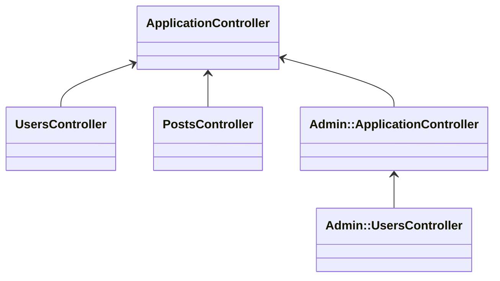

# デフォルトのビューヘルパのスコープについて

この記事では Rails のビューヘルパで定義されたメソッドがどの範囲をスコープとしているか、
このスコープを変更する方法、そして既存アプリから安全にスコープを変更する合理的な手順を説明します。

# ヘルパに定義したメソッドはどのビューからでも呼び出せる

例えば、次のように `UsersHelper#display_name` があったとして

```ruby:app/helpers/users_helper.rb
module UsersHelper
  def display_name(user)
    "#{user.lastname} #{user.firstname}"
  end
end
```

これは、 `UsersController` が描画するビューに限らず、別のコントローラが描画するビューの中でも使うことができます。

```ruby:app/controllers/posts_controller.rb
class PostsController
  def index
    @posts = Post.all
  end
end
```
```erb:app/views/posts/index.html.erb
<% @posts.each do |post| %>
  <p><%= post.content %></p>
  <small><%= display_name(post.user) %></small> <!-- display_name が使える -->
<% end %>
```

つまり、ビューヘルパで定義したメソッドは基本的にどのビューでも使えるということになります。

このビューヘルパの挙動ですが、そういう仕様だと割り切ることもできますが、適用範囲が広いため懸念もあります。
気になる点としては以下のようなものがあります。

* そのメソッドが未使用であることを確認するためにはアプリケーション全体を調べる必要がある
* 別々のビューヘルパで同名のメソッドが定義された場合の動きの把握が困難

そういった懸念に対する回避方法として、 Rails ではオプションが提供されています。

# config.action_controller.include_all_helpers オプション

上記のとおり、 Rails の controller は、デフォルトですべての helper を読み込みますが、これは、 `config.action_controller.include_all_helpers` の設定値によるものです。

https://railsguides.jp/configuring.html#config-action-controller-include-all-helpers

> すべてのビューヘルパーをあらゆる場所で使えるようにするか、対応するコントローラのスコープ内に限定するかを設定します。

デフォルトではこの値は `true` です。

というわけで、この値を `config/application.rb` あたりで設定すると挙動が変わります。

```diff ruby:config/application.rb
 module Example
   class Application < Rails::Application
     # Initialize configuration defaults for originally generated Rails version.
     config.load_defaults 8.0
+
+   config.action_controller.include_all_helpers = false
```

そうすると、例えば以下のように `UsersHelper` で定義されているメソッド `display_name` を、
`PostsController` が描画するビューでは呼び出せなくなります。

```ruby:app/helpers/users_helper.rb
module UsersHelper
  def display_name(user)
    "#{user.lastname} #{user.firstname}"
  end
end
```

```ruby:app/controllers/posts_controller.rb
class PostsController
  def index
    @posts = Post.all
  end
end
```
```erb:app/views/posts/index.html.erb
<% @posts.each do |post| %>
  <p><%= post.content %></p>
  <!-- 呼び出せない！ -->
  <small><%= display_name(post.user) %></small> <!-- undefined method 'display_name' for ... -->
<% end %>
```

## 適用されるヘルパはどうやって決定されるのか?

例えば、以下のようなコントローラおよびビューヘルパの継承関係があったとして説明します。



```
app/
├── controllers
│   ├── admin
│   │   ├── application_controller.rb
│   │   └── users_controller.rb
│   ├── application_controller.rb
│   ├── posts_controller.rb
│   └── users_controller.rb
└── helpers
    ├── admin
    │   ├── application_helper.rb
    │   └── users_helper.rb
    ├── application_helper.rb
    ├── posts_helper.rb
    └── users_helper.rb
```

```ruby
class ApplicationController < ActionController::Base; end

class UsersController < ApplicationController; end

class PostsController < ApplicationController; end

class Admin::ApplicationController < ApplicationController; end

class Admin::UsersController < Admin::ApplicationController; end
```

`UsersController` のコンテクストで適用される helper は以下のようになります。

1. `UsersHelper`
2. `ApplicationHelper` (常に）

これは、コントローラでの継承関係に依存しています。
`UsersController` では `UsersHelper` が自動的にインクルードされ、その一方で `ApplicationController` では `ApplicationHelper` がインクルードされています。
ゆえに `UsersController` では `UsersHelper` `ApplicationHelper` のメソッドが適用可能になります。

もう一例出しますと、 `Admin::UsersController` のコンテクストでは適用される helper は以下のようになります。

1. `Admin::UsersHelper`
2. `Admin::ApplicationHelper`
3. `ApplicationHelper`

これも、継承関係と照らし合わせるとわかります。
`Admin::UsersHelper`, `Admin::ApplicationHelper` そして `ApplicationHelper` という順番でたどります。

この挙動は、テンプレートやパーシャルを描画する際の探索パスの仕組みである**テンプレートの継承と同じ**形です。
https://railsguides.jp/layouts_and_rendering.html#%E3%83%86%E3%83%B3%E3%83%97%E3%83%AC%E3%83%BC%E3%83%88%E3%81%AE%E7%B6%99%E6%89%BF

# 既存アプリケーションで include_all_helpers を false にしたい

これは非常に有用です。
というわけで既存のアプリケーションで `config.action_controller.include_all_helpers` を `false` にする場合のマイグレーションパスをたどってみます。

## はじめの一歩

はじめにやることは、もちろん `config.action_controller.include_all_helpers` 設定値を `false` にすることです。

```diff ruby:config/application.rb
 module Example
   class Application < Rails::Application
     # Initialize configuration defaults for originally generated Rails version.
     config.load_defaults 8.0
+
+   config.action_controller.include_all_helpers = false
```

このままだと、これまで「なんとなく届いていた」ヘルパ呼び出しが落ちる箇所が出ます。
**一時対応として `ApplicationHelper` で全ヘルパを include** し、既存動作を維持します。

```ruby:app/helpers/application_helper.rb
module ApplicationHelper
  include Admin::ApplicationHelper
  include Admin::UsersHelper
  include PostsHelper
  include UsersHelper
end
```

（多くのアプリでは全コントローラが最終的に `ApplicationController` を継承するため、`ApplicationHelper` はあらゆるビューで有効になります。）

## 段階的によりわける

ここから **依存関係を縮小** していきます。例として、`Admin::*` 配下は必ず `Admin::ApplicationController` を継承しているなら、そちら側でまとめます。

```ruby:app/helpers/application_helper.rb
module ApplicationHelper
  include Admin::ApplicationHelper
  include PostsHelper
  include UsersHelper
end
```
```ruby:app/helpers/admin/application_helper.rb
module Admin::ApplicationHelper
  include Admin::UsersHelper
end
```

さらに、特定コントローラでしか使っていないヘルパは `ApplicationHelper` から外していきます。

```diff ruby:app/helpers/application_helper.rb
 module ApplicationHelper
   include Admin::ApplicationHelper
-  include PostsHelper
   include UsersHelper
 end
```

逆に、複数コンテキストで使う汎用メソッドは **`ApplicationHelper` に移す** とよいでしょう。

```diff ruby:app/helpers/application_helper.rb
 module ApplicationHelper
   include Admin::ApplicationHelper
-  include UsersHelper
+
+  def very_useful_helper_method(user)
+    #
+  end
 end
```
```diff ruby:app/helpers/users_helper.rb
 module UsersHelper
-  def very_useful_helper_method(user)
-    #
-  end
 end
```

こうした調整で、最終的に **「必要な場面だけに届く」** スコープへ収束させられます。

## gem が提供するヘルパメソッドが使えなくなったとき

たとえば、 [font-awesome-rails](https://github.com/bokmann/font-awesome-rails) などで顕在化することがあります。

font-awesome-rails はビューヘルパとしてのメソッド `fa_icon` を提供するのですが、これが `config.action_controller.include_all_helpers` の値が `false` の場合は明示的にインクルードを要します。
その場合は `ApplicationHelper` で明示的にインクルードすれば解決します。
使用していることがより明示的になって保守性の点から良い選択だと思います。

```ruby:app/helpers/application_helper.rb
module ApplicationHelper
  include FontAwesome::Rails::IconHelper
end
```

[関連 issue](https://github.com/bokmann/font-awesome-rails/issues/86)

# まとめ

* デフォルトでは、ビューヘルパで定義したメソッドはどのコントローラのビューからでも使えます。
* `config.action_controller.include_all_helpers = false` にすると、コントローラに対応する（および階層に沿った）ヘルパのみが読み込まれます。
* `ApplicationHelper` は設定に関わらず常に読み込まれるため、共通メソッドの受け皿として有効です。
* 既存移行は「いったん `ApplicationHelper` で集約 → 段階的に縮小・移動」という手順が安全です。

# 免責事項など

この記事の内容は Rails 8.0.2.1 で確認しています。が、基本的に過去の多くのバージョンでは同様です。
(正確には `include_all_helpers` が導入された Rails 3.1 以降を前提にしています)
